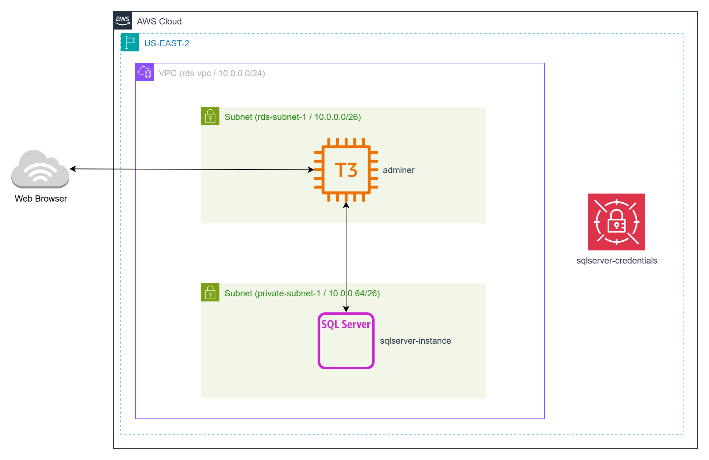
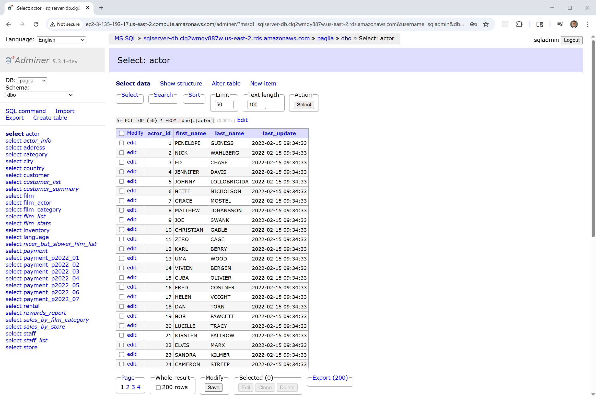

# Deploying SQL Server in AWS

This project provides a guide to deploying Microsoft SQL Server 2022 Standard Edition on AWS using Amazon RDS for SQL Server.
This managed database service allows developers and organizations to set up, operate, and scale SQL Server databases in the cloud with ease,
eliminating the need for manual infrastructure management.

Whether you're creating a lightweight development environment for testing or a robust, production-grade backend for mission-critical applications,
Amazon RDS for SQL Server offers flexible deployment options with built-in backups, patching, and scaling.

As part of this project, we deploy an Adminer web-based database management tool on an Ubuntu EC2 instance.
This allows you to connect to and manage the private RDS SQL Server instance securely from your browser.

For demonstration purposes, the deployment can also include the Pagila sample database — a well-known schema and dataset modeled after a fictional DVD rental store.
Loading Pagila into SQL Server provides realistic tables, relationships, and sample data, making it easy to run example queries and explore database features in a hands-on way.



## What You'll Learn

- How to provision a private RDS SQL Server instance with Terraform
- How to deploy Adminer on Ubuntu EC2 to manage SQL Server
- Best practices for security, networking, and IAM roles for database workloads
- How to generate and securely handle SQL Server credentials in Terraform

## Prerequisites

* [An AWS Account](https://aws.amazon.com/console/)
* [Install AWS CLI](https://docs.aws.amazon.com/cli/latest/userguide/getting-started-install.html) 
* [Install Latest Terraform](https://developer.hashicorp.com/terraform/install)

If this is your first time watching our content, we recommend starting with this video: [AWS + Terraform: Easy Setup](https://youtu.be/BCMQo0CB9wk). It provides a step-by-step guide to properly configure Terraform, Packer, and the AWS CLI.

## Download this Repository

```bash
git clone https://github.com/mamonaco1973/aws-sqlserver.git
cd aws-sqlserver
```

## Build the Code

Run [check_env](check_env.sh) then run [apply](apply.sh).

```bash
~/aws-sqlserver$ ./apply.sh
NOTE: Validating that required commands are found in your PATH.
NOTE: aws is found in the current PATH.
NOTE: sqlcmd is found in the current PATH.
NOTE: terraform is found in the current PATH.
NOTE: jq is found in the current PATH.
NOTE: All required commands are available.
NOTE: Checking AWS CLI connection.
NOTE: Successfully logged into AWS.
NOTE: Building Database Instances.
Initializing the backend...
Initializing provider plugins...
Terraform has been successfully initialized!
```

## Build Results

After applying the Terraform scripts, the following AWS resources will be created:

### VPC & Subnets
- Custom VPC for RDS and EC2 instances
- Two private subnets for the RDS SQL Server instance
- One public subnet for the Adminer EC2 instance
- Internet Gateway for public subnet
- Route tables for public/private traffic separation

### Security Groups
- `rds_sg` – Allows SQL Server access from the Adminer EC2 instance
- `web_sg` – Allows HTTP access to Adminer

### Secrets & Credentials
- Random SQL Server admin password generated via `random_password`
- Credentials passed securely to EC2 user-data and RDS instance

### RDS SQL Server
- SQL Server 2022 Standard Edition (`sqlserver-se`)
- Instance type: `db.m5.large`
- Private subnet group
- 7-day backup retention
- Not publicly accessible

### Adminer EC2 Instance
- Ubuntu 24.04 AMI (fetched from SSM Parameter Store)
- t3.micro instance in public subnet
- Configured via user-data to install Adminer and connect to RDS SQL Server
- Public IP and DNS for browser access

## Adminer Demo

[Adminer](https://www.adminer.org/) is a simple web-based and cross-platform SQL client.



Query 1:
```sql
SELECT TOP 100                       -- Limit the number of rows returned to 100
    f.title AS film_title,           -- Select the 'title' column from the 'film' table and rename it to 'film_title'
    a.first_name + ' ' + a.last_name AS actor_name 
                                     -- Concatenate 'first_name' and 'last_name' from the 'actor' table with a space
                                     -- Alias the concatenated result as 'actor_name' for readability
FROM
    film f                           -- Use the 'film' table as the primary dataset and alias it as 'f'
JOIN
    film_actor fa                    -- Join the linking table 'film_actor' that associates films with actors
    ON f.film_id = fa.film_id        -- Match rows where the film's unique ID equals the film_actor's film ID
JOIN
    actor a                          -- Join the 'actor' table to retrieve actor details
    ON fa.actor_id = a.actor_id      -- Match rows where the actor's unique ID equals the film_actor's actor ID
ORDER BY 
    f.title,                         -- Sort results by the film title in ascending alphabetical order
    actor_name;                      -- Within each film, sort the actor names alphabetically
```

Query 2:

```sql
SELECT TOP 100                               -- Limit the output to the first 100 rows returned
    f.title,                                 -- Select the 'title' column from the 'film' table
    STRING_AGG(a.first_name + ' ' + a.last_name, ', ') AS actor_names
                                             -- Use STRING_AGG to concatenate all actor names for each film
                                             -- Combine 'first_name' and 'last_name' separated by a space
                                             -- Separate multiple actor names in the aggregated string with a comma and a space
                                             -- Alias the resulting concatenated list as 'actor_names'
FROM
    film f                                   -- Use the 'film' table as the main dataset and alias it as 'f'
JOIN
    film_actor fa                            -- Join the linking table 'film_actor' to connect films and actors
    ON f.film_id = fa.film_id                -- Match rows where film IDs from both tables are equal
JOIN
    actor a                                  -- Join the 'actor' table to get actor details
    ON fa.actor_id = a.actor_id              -- Match rows where actor IDs from both tables are equal
GROUP BY
    f.title                                  -- Group the results by each film title so all associated actors are aggregated together
ORDER BY
    f.title;                                 -- Sort the output alphabetically by film title
```


